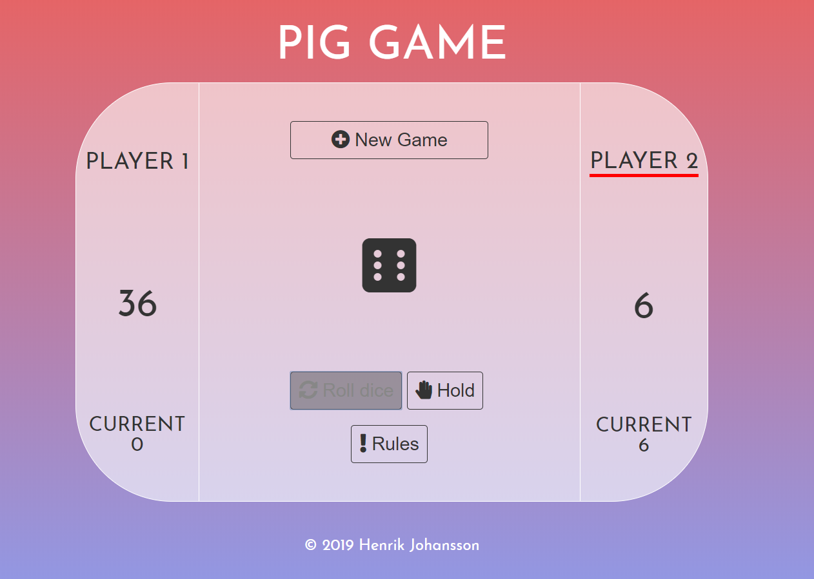

# Pig Game

This is a Javascript implementation of the Pig Game I made to get som JS practice. I mostly wanted to try out the document.querySelector. This was inpired by this tutorial: https://www.youtube.com/watch?v=W1_0YLzACTA&t=1455s by Learn for Free. The app uses CSS-flexbox for the layout. The app also utilizes Font Awesome for the icons and the Google font 'Josefin Sans'.

## Preview Image

